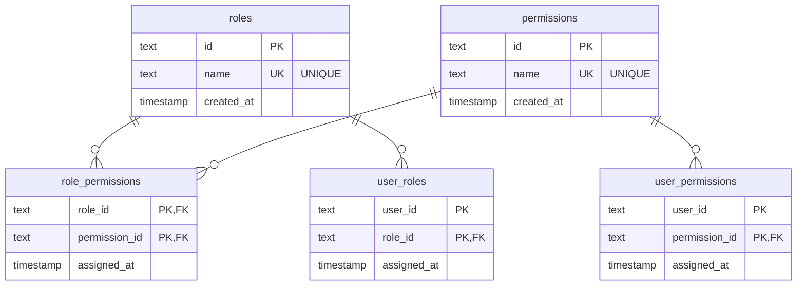

# @arxjs/core

Modern, type-safe authorization library for Node.js and TypeScript. Provides Role-Based Access Control (RBAC) with direct permission grants — storage-agnostic via an adapter pattern.

## Features

- **RBAC + direct permissions** — assign roles and/or permissions directly to users
- **Storage-agnostic** — bring your own database via a `StorageAdapter`; official adapters for [Prisma](./../prisma), [Drizzle ORM](./../drizzle), and [TypeORM](./../typeorm) are available
- **Fully typed** — strict TypeScript 5.x
- **Minimal surface** — one factory function, everything else is tree-shakeable
- **Built-in test adapter** — `InMemoryAdapter` for unit tests and prototyping

## Installation

```bash
pnpm add @arxjs/core
# npm install @arxjs/core
# yarn add @arxjs/core
```

You also need a storage adapter. See the [available adapters](#available-adapters).

## Quick start

```ts
import { createAuthorization } from '@arxjs/core'
import { PrismaAdapter } from '@arxjs/prisma'

const arx = createAuthorization({
  adapter: new PrismaAdapter(prisma),
})

// Set up roles and permissions (e.g. in a seed script, run once)
await arx.createPermission('post:edit')
await arx.createPermission('post:delete')
await arx.createRole('editor', { permissions: ['post:edit'] })

// Assign roles and permissions to users at runtime
await arx.assignRole('user-1', 'editor')
await arx.assignPermission('user-1', 'post:delete') // direct grant

// Check access
await arx.can('user-1', 'post:edit')    // true  (via role)
await arx.can('user-1', 'post:delete')  // true  (direct)
await arx.can('user-2', 'post:edit')    // false
```

## API

### `createAuthorization(config)`

Returns an `Authorization` object bound to the provided adapter. Call it once at application startup and share the result (or destructure the functions you need) across your app.

```ts
const arx = createAuthorization({ adapter })

// or destructure only what you need
const { can, assignRole } = createAuthorization({ adapter })
```

### Checking access

```ts
arx.can(userId, permission)                   // true if user holds the permission (direct or via role)
arx.canAll(userId, [permission, ...])         // true if user holds ALL listed permissions
arx.canAny(userId, [permission, ...])         // true if user holds AT LEAST ONE
arx.hasRole(userId, role)                     // true if the role is assigned to the user
```

### Roles

```ts
arx.createRole(name)
arx.createRole(name, { ifExists: 'ignore' })              // no-op if the role already exists
arx.createRole(name, { permissions: ['perm:a', ...] })    // create + grant permissions in one call
arx.deleteRole(name)                                       // idempotent, no-op if not found
arx.assignRole(userId, roleName)                           // idempotent
arx.revokeRole(userId, roleName)                           // idempotent
arx.getRoles(userId)                                       // Role[]
arx.getRolePermissions(roleName)                           // Permission[]
```

### Permissions

```ts
arx.createPermission(name)
arx.createPermission(name, { ifExists: 'ignore' })
arx.deletePermission(name)                                 // idempotent, no-op if not found
arx.assignPermission(userId, permissionName)               // direct grant, idempotent
arx.revokePermission(userId, permissionName)               // idempotent
arx.grantPermissionToRole(roleName, permissionName)        // idempotent
arx.revokePermissionFromRole(roleName, permissionName)     // idempotent
arx.getPermissions(userId)                                 // all effective permissions (direct + via roles), deduplicated
arx.getDirectPermissions(userId)                           // only direct grants, excludes role-inherited
```

### Error types

All errors extend `ArxError` which extends `Error`.

| Class | When thrown |
|---|---|
| `RoleAlreadyExistsError` | `createRole` with a name that already exists |
| `RoleNotFoundError` | `assignRole`, `grantPermissionToRole` with a non-existent role |
| `PermissionAlreadyExistsError` | `createPermission` with a name that already exists |
| `PermissionNotFoundError` | `assignPermission`, `grantPermissionToRole` with a non-existent permission |

Each error exposes the offending name as a typed property (`roleName` or `permissionName`):

```ts
import { RoleNotFoundError } from '@arxjs/core'

try {
  await arx.assignRole(userId, 'ghost')
} catch (err) {
  if (err instanceof RoleNotFoundError) {
    console.log(err.roleName) // 'ghost'
  }
}
```

## In-memory adapter

`InMemoryAdapter` is included in `@arxjs/core` for unit tests and prototyping. It holds all data in memory and provides a `reset()` method to clear state between tests.

```ts
import { createAuthorization, InMemoryAdapter } from '@arxjs/core'

const adapter = new InMemoryAdapter()
const arx = createAuthorization({ adapter })

afterEach(() => adapter.reset())
```

## Available adapters

| Package | ORM / Database |
|---|---|
| [`@arxjs/prisma`](https://github.com/lcubas/arx/tree/main/packages/prisma) | Prisma — PostgreSQL, MySQL, SQLite, SQL Server, MongoDB |
| [`@arxjs/drizzle`](https://github.com/lcubas/arx/tree/main/packages/drizzle) | Drizzle ORM — PostgreSQL, MySQL, SQLite |
| [`@arxjs/typeorm`](https://github.com/lcubas/arx/tree/main/packages/typeorm) | TypeORM — PostgreSQL, MySQL, MariaDB, SQLite, SQL Server |

## Database schema

All adapters expect the same five tables. If you're using the ORM adapters, the schema is provided for you — see each adapter's README for migration instructions. If you manage your own migrations (Flyway, Liquibase, raw SQL, etc.), create the tables below.

> Column types shown are generic. Map them to the appropriate types for your database — `TEXT` for SQLite, `VARCHAR(36)` for MySQL, `TEXT` or `UUID` for PostgreSQL.



Key constraints:
- `roles.name` and `permissions.name` must be unique.
- `role_permissions`, `user_roles`, and `user_permissions` use composite primary keys.
- Foreign keys on `role_id` and `permission_id` should cascade on delete.
- `user_id` is a plain string — arx does not manage a `users` table. You supply the user ID from your own auth system.

## Advanced: writing a custom adapter

If none of the official adapters fit your stack, you can implement `StorageAdapter` directly and plug it into arx.

```ts
import type { Permission, Role, StorageAdapter } from '@arxjs/core'
import {
  PermissionAlreadyExistsError,
  PermissionNotFoundError,
  RoleAlreadyExistsError,
  RoleNotFoundError,
} from '@arxjs/core'

export class MyAdapter implements StorageAdapter {
  async createRole(name: string): Promise<Role> { ... }
  async findRole(name: string): Promise<Role | null> { ... }
  async deleteRole(name: string): Promise<void> { ... }

  async createPermission(name: string): Promise<Permission> { ... }
  async findPermission(name: string): Promise<Permission | null> { ... }
  async deletePermission(name: string): Promise<void> { ... }

  async assignRoleToUser(userId: string, roleName: string): Promise<void> { ... }
  async revokeRoleFromUser(userId: string, roleName: string): Promise<void> { ... }
  async getRolesForUser(userId: string): Promise<Role[]> { ... }

  async grantPermissionToRole(roleName: string, permissionName: string): Promise<void> { ... }
  async revokePermissionFromRole(roleName: string, permissionName: string): Promise<void> { ... }
  async getPermissionsForRole(roleName: string): Promise<Permission[]> { ... }

  async grantPermissionToUser(userId: string, permissionName: string): Promise<void> { ... }
  async revokePermissionFromUser(userId: string, permissionName: string): Promise<void> { ... }
  async getDirectPermissionsForUser(userId: string): Promise<Permission[]> { ... }

  async getEffectivePermissions(userId: string): Promise<Permission[]> { ... }
}
```

**Error conventions your adapter must follow:**
- `createRole` → throw `RoleAlreadyExistsError` if a role with that name exists.
- `createPermission` → throw `PermissionAlreadyExistsError` if a permission with that name exists.
- `assignRoleToUser`, `grantPermissionToRole` → throw `RoleNotFoundError` if the role doesn't exist.
- `grantPermissionToRole`, `grantPermissionToUser` → throw `PermissionNotFoundError` if the permission doesn't exist.
- All revoke/delete methods should be idempotent — no error if the resource doesn't exist.

Once implemented, pass it to `createAuthorization` like any other adapter.

## License

MIT
